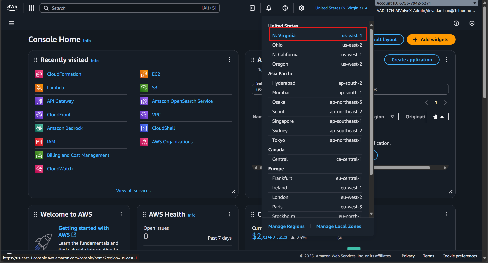
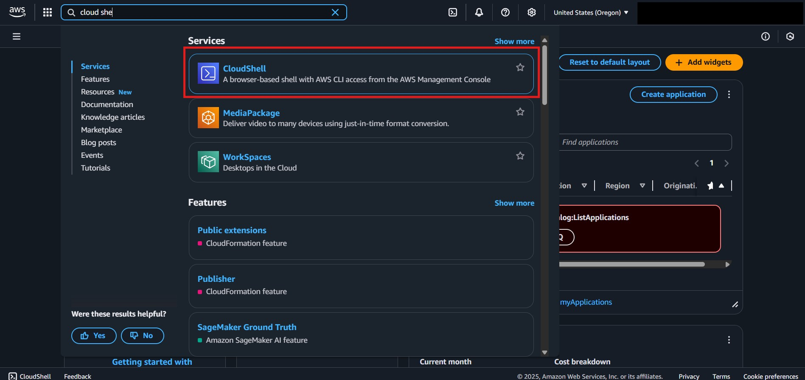
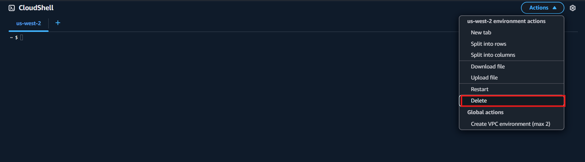
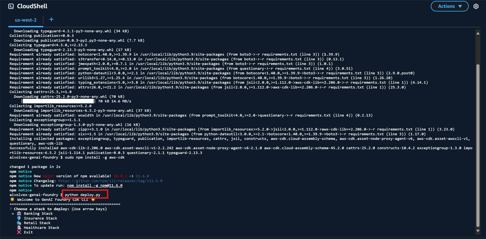
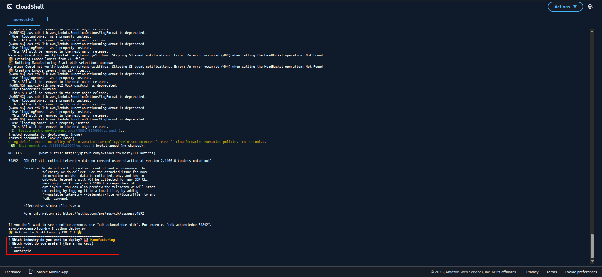
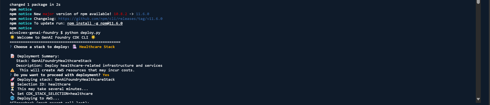
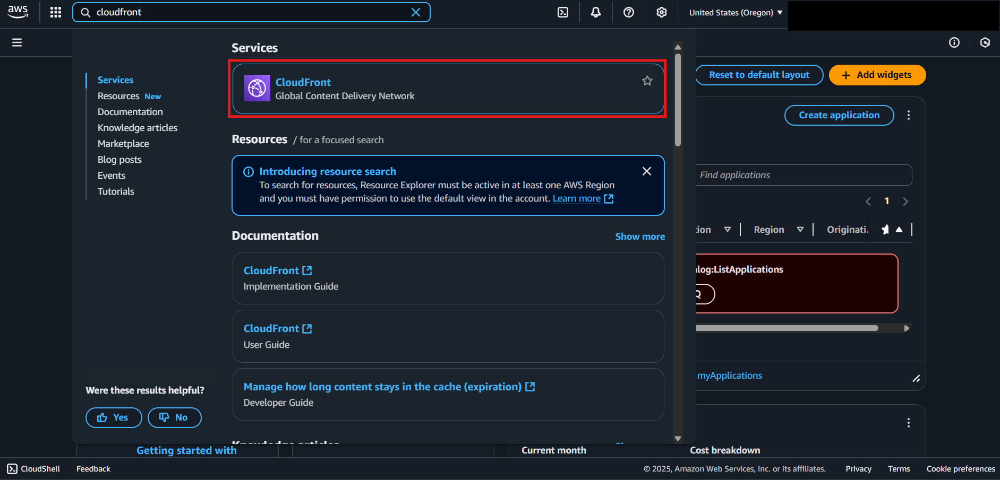
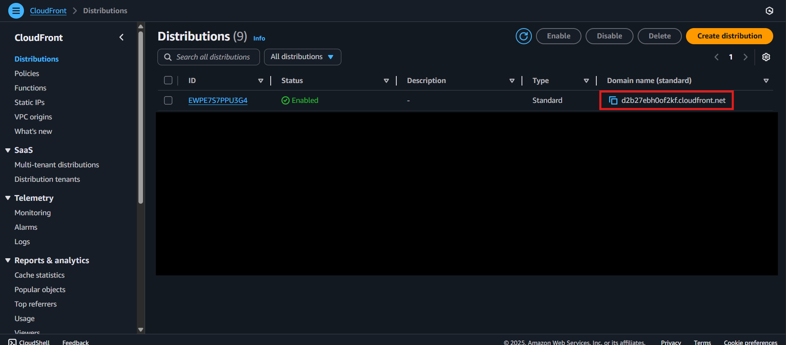

# GenAI Foundry CDK Deployment Guide
## Overview
**GenAI Foundry** is an AI-powered sandbox platform for banking and insurance. Powered by Generative AI with RAG-enabled conversational capabilities, it delivers intelligent virtual assistants, voice-enabled chatbots, automated document processing, and advanced risk assessment. It enables post-call analysis, underwriting decision support, and multi-channel customer engagement—driving faster decisions, greater efficiency, and exceptional customer experiences.
> **Disclaimer**: This CDK setup is strictly designed and tested for the `us-east-1` region (N. Virginia) and `us-west-2` (Oregon). Please ensure that all resources are deployed only within these regions to avoid compatibility issues.
---
## Prerequisites
Before beginning the deployment process:
* Ensure you have access to the correct AWS account.
* You must be using the **`us-east-1`** or **`us-west-2`** AWS region.
---
## Pre Deployment Steps
### Login to the AWS Console
Log in to the provided AWS account using the IAM credentials or SSO as per the shared instructions.
## Deployment Steps

### 1. Set Region to `us-east-1` or `us-west-2`
Navigate to the region selector in the AWS Console and ensure that either **`US East (N. Virginia) - us-east-1`** or **`US WEST (Oregon) - us-west-2`** is selected.
> This is critical, as all the CDK resources are scoped and supported only in these region.

---
### 2. Open AWS CloudShell
Launch the AWS CloudShell service from the AWS Console.
> CloudShell provides a pre-configured environment with AWS CLI and CDK support, making it ideal for deployments.

---
### 3. Clone the Repository
```bash
git clone https://github.com/1CloudHub/aivolvex-genai-foundry.git
```

```bash
cd aivolvex-genai-foundry/
```
> Clones the specific branch of the GenAI Foundry CDK repository to your CloudShell environment.
---
### 4. Install python requirements
```bash
pip install -r requirements.txt
```
> Installs the AWS CDK Command Line Interface globally in CloudShell.

> ⚠️ **ERROR HANDLING ONLY - DO NOT RUN UNLESS YOU ENCOUNTER SPACE/MEMORY ERRORS:**


If you encounter memory or disk space issues in CloudShell:

- Click the **Actions** menu at the top-right of the CloudShell terminal
- Choose **Delete** to remove the terminal environment
- Open a new CloudShell terminal
- Start again from **Step 1** of this guide

> ⚠️ **Important**: These commands above should ONLY be executed if you encounter an "insufficient space" or memory-related error during installation (common in AWS CloudShell due to limited storage). Do not run these commands as part of the normal installation process.

---
### 5. Install AWS CDK CLI
```bash
sudo npm install -g aws-cdk
```
> Installs the required Python packages for the CDK app to function properly.
---
### 6. Bootstrap CDK
```bash
cdk bootstrap
```
If you face a `No storage available` error then run this command
```bash
rm -rf ~/.local/bin/qchat ~/.local/bin/q ~/.local/bin/qterm
```
> Prepares your AWS environment for deploying CDK applications by provisioning necessary resources like the CDK toolkit stack.
---
### 7. Deploy the Stack
```bash
python deploy.py
```


We have used the models listed here:
  ```
  - Claude 3.5 Sonnet
  - Claude 3.7 Sonnet
  - Amazon Nova Pro
  - Amazon Nova Premium
  ```
---
---


### 8. Confirm Deployment


Select the desired stack from the available options and press 'y' when prompted to confirm the deployment.

> Deploys the defined CDK infrastructure into your AWS account. This may take several minutes. Wait until the deployment completes successfully.

### 9. Get the Application URL
Navigate to the **CloudFront** service.
* Select the newly created distribution.
* Copy the **Domain Name** listed under **General settings**.
> This is your application's public URL. Note that it may take **5–6 minutes** post-deployment for the CloudFront distribution to become active.


---
## Accessing the Application
Once the CloudFront distribution is active and model access is approved, open the copied domain name in your browser to start using **GenAI Foundry**.
Enjoy the application experience.

>* ⚠️ **Deployment time**: Deployment typically takes 20–30 minutes. After a successful deployment, please wait an additional 10 minutes before using the application.
>* ❗ **EC2 restart note**: If the underlying EC2 instance is stopped and started again, the application will not run automatically and may run into issues.
---
## Used AWS services
```
1 Networking and Security
1.1 VPC - Virtual Private Cloud with public and private subnets
1.2 Subnets
1.2.1 Public Subnet
1.2.2 Private Subnet with EGRESS
1.3 Security Groups
1.3.1 EC2 Security Group
1.3.2 RDS Security Group
1.3.3 Lambda Security Group
1.4 EC2 Key Pair - For SSH access

2 Compute
2.1 EC2 Instances
2.1.1 Main EC2 Instance (T3 Medium with GPU Deep Learning AMI)
2.1.2 Frontend EC2 Instance (T3 Medium)

3 Database
3.1 RDS PostgreSQL Instance (T3 Micro)
3.2 RDS Subnet Group - For database placement

4 Storage
4.1 S3 Buckets
4.1.1 Knowledge Base Bucket
4.1.2 Frontend Bucket
4.1.3 Voice Operations Bucket
4.2 S3 Deployments
4.2.1 Knowledge Base folder deployment
4.2.2 Frontend folder deployment
4.2.3 Healthcare KB folder deployment

5 AI and ML Services
5.1 Bedrock Knowledge Base - Healthcare KB
5.2 Bedrock Data Source - For knowledge base ingestion
5.3 OpenSearch Serverless Collection - Healthcare collection
5.4 OpenSearch Security Policies
5.4.1 Encryption Policy
5.4.2 Network Policy
5.5 OpenSearch Data Access Policy

6 Lambda Functions
6.1 Healthcare Index Creator Function
6.2 Healthcare Index Waiter Function
6.3 Auto Sync Function
6.4 Initial Sync Function
6.5 WebSocket Handler Function

7 Lambda Layers
7.1 Boto3 Layer
7.2 Psycopg2 Layer
7.3 Requests Layer
7.4 OpenSearch Python Layer
7.5 AWS4Auth Layer

8 API and Integration
8.1 API Gateway REST API - GenAI Foundry API
8.1.1 /chat_api
8.1.2 /genai_foundry_misc
8.1.3 /opensearch
8.1.4 /voiceops
8.2 API Gateway v2 WebSocket API
8.3 WebSocket Stage - Production

9 IAM Roles and Policies
9.1 Bedrock Knowledge Base Role
9.2 Lambda Index Creator Role
9.3 Lambda Auto-Sync Role
9.4 EC2 Role

10 Secrets Management
10.1 RDS Credentials Secret

11 Monitoring and Logging
11.1 CloudWatch Log Groups
 ```

## About GenAI Foundry

GenAIFoundry enables banking and insurance teams to explore AI-powered solutions through an intelligent assistant that understands context, retrieves precise insights, and delivers accurate responses. From post-call analysis to underwriting decision support and multi-channel customer engagement, it transforms complex processes into clear, actionable outcomes—enhancing efficiency, accuracy, and customer satisfaction.

---

## Legal Notice

© 1CloudHub. All rights reserved.

The materials and components herein are provided for demonstration purposes only. No portion of this project may be implemented in a live or production environment without prior technical assessment, security clearance, and explicit approval from 1CloudHub.

---
